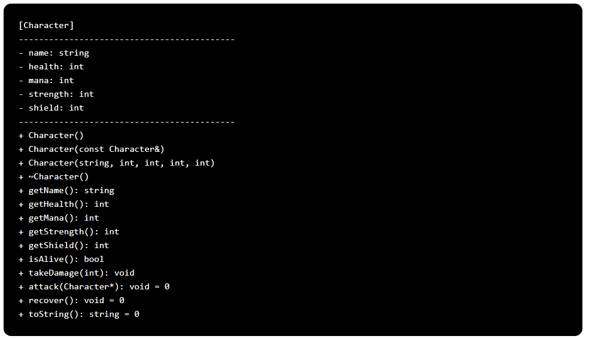
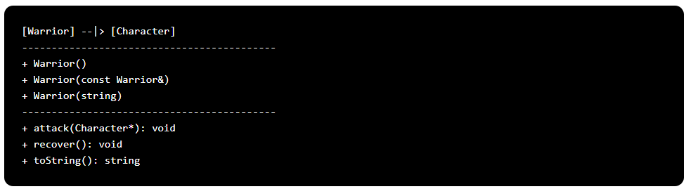
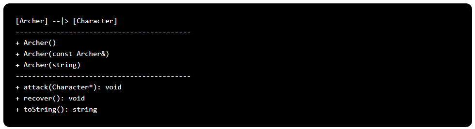
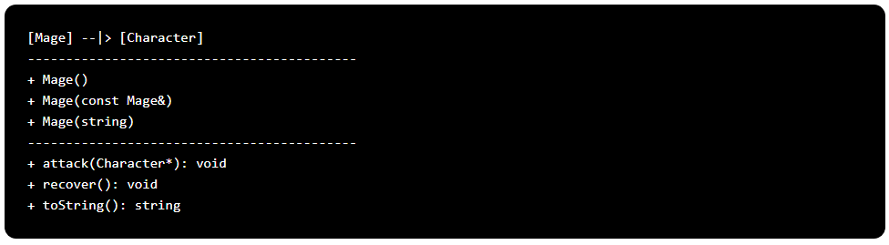
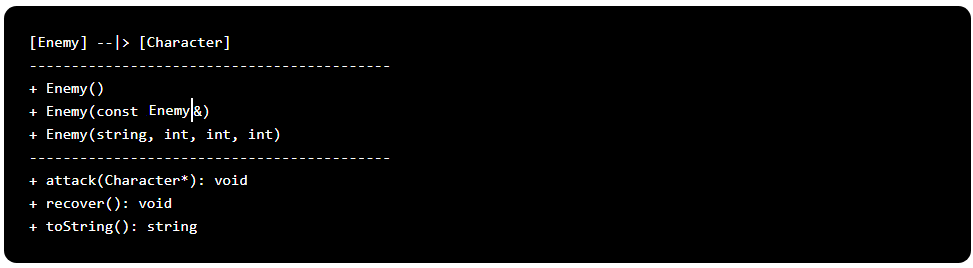
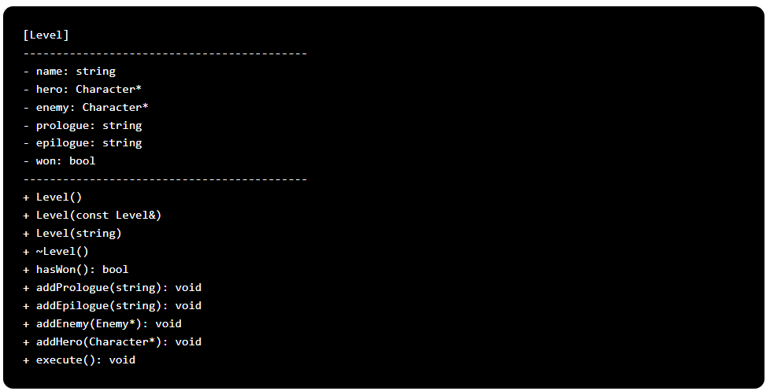

# Actividad: Juego de Rol (RPG)

## Descripción General
Este proyecto es un juego de rol (RPG) que se basa en personajes que interactúan en un mundo de fantasía. Cada personaje tiene atributos y habilidades particulares que lo distinguen, y pueden enfrentarse entre sí y contra enemigos en batallas donde la estrategia y el uso inteligente de habilidades son claves para la victoria.

## Objetivos del Proyecto
El propósito de este proyecto es poner en práctica los conceptos fundamentales de Programación Orientada a Objetos (POO), incluyendo herencia, polimorfismo, modificadores de acceso, sobrecarga de métodos y manejo de excepciones. Además, se busca utilizar la sobrecarga de operadores para facilitar ciertas operaciones dentro del juego.

### Características Principales
Clases y Herencia:
* Personaje: Clase base abstracta que define atributos y métodos comunes a todos los personajes.
* Guerrero, Mago, Arquero: Clases derivadas que heredan de Personaje y sobrescriben métodos para implementar comportamientos específicos. 
* Polimorfismo y Sobrecarga de Métodos:
    * Métodos como atacar, defender y usarHabilidad son definidos en la clase base Personaje y sobrescritos en las clases derivadas para proporcionar comportamientos específicos. 

## Estructura del Proyecto
El proyecto está organizado en archivos y clases cuidadosamente diseñados:
* Archivo de encabezado de personajes (*character.h*): Contiene las definiciones y las implementaciones de las clases Character, Warrior, Archer, Mage, y Enemy.
* Archivo de encabezado del nivel (*level.h*): Incluye la definición e implementación de la clase Level.
* Archivo principal (*main.cpp*): Contiene el diseño de un pequeño RPG. **No es necesario que realices ningún cambio en este archivo; puedes utilizarlo para probar el código que has generado**.

### Descripción de las Clases

#### Clase ``Character``

La clase ``Character`` define un personaje con los siguientes atributos protegidos: nombre (``name``), salud (``health``), maná (``mana``), fuerza (``strength``) y escudo (``shield``). Esta clase incluye varios constructores para inicialización, un destructor virtual esencial para la herencia polimórfica, y métodos públicos para obtener los valores de los atributos y comprobar si el personaje está vivo, determinado por una salud mayor a 0. Los métodos virtuales puros ``attack``, ``recover``, y ``toString`` deben ser implementados en las clases derivadas. El método ``takeDamage`` calcula el daño real restando el escudo del daño recibido; si el daño real es positivo, se reduce la salud del personaje en consecuencia. Los constructores inicializan los atributos con valores por defecto, por copia de otro objeto ``Character``, o con valores específicos proporcionados por el usuario. El método ``isAlive`` comprueba si el personaje está vivo. Determina que el personaje sigue con vida si su salud (``health``) es mayor a 0. El destructor virtual se define para garantizar la correcta liberación de recursos en la herencia. Aunque actualmente no realiza ninguna operación, permite que las clases derivadas implementen sus propios destructores, lo que podría ser útil para futuras expansiones de características. 

#### Clase ``Warrior``

La clase ``Warrior`` hereda de la clase ``Character`` e implementa las funciones virtuales puras definidas en la clase base. Define tres constructores: un constructor predeterminado que inicializa los atributos con valores específicos para un guerrero ("Warrior", 80, 30, 40, 20), un constructor de copia y uno que inicializa el nombre según el parámetro dado, pero mantiene los mismos valores predeterminados para los demás atributos. El método ``attack`` permite al guerrero atacar a otro Character. Si el guerrero tiene al menos 10 puntos de maná, realiza un ataque fuerte que consume maná y causa el doble de daño de su fuerza. De lo contrario, realiza un ataque normal. El método ``recover`` aumenta la salud y el maná del guerrero, pero establece límites máximos de 80 y 30 respectivamente. Finalmente, el método ``toString`` genera una representación en cadena del guerrero, incluyendo su nombre, salud y maná, para facilitar la salida de información en formato de texto.

#### Clase ``Archer``

La clase ``Archer`` hereda de ``Character`` e implementa sus métodos virtuales. Incluye tres constructores: un constructor predeterminado que inicializa los atributos con valores específicos para un arquero ("Archer", 60, 50, 30, 15), un constructor de copia y uno que inicializa el nombre según el parámetro dado, pero mantiene los mismos valores predeterminados para los demás atributos. El método ``attack`` permite al arquero atacar a otro personaje; si tiene al menos 20 puntos de maná, realiza un ataque fuerte que consume maná y causa el triple de daño de su fuerza. En caso contrario, realiza un ataque normal. El método ``recover`` incrementa la salud y el maná, estableciendo límites máximos de 60 y 50, respectivamente. Finalmente, ``toString`` devuelve una cadena con el nombre del arquero, salud y maná para facilitar la salida de información.

#### Clase ``Mage``

La clase ``Mage`` hereda de ``Character`` e implementa sus métodos virtuales. Incluye tres constructores: uno predeterminado que inicializa los atributos con valores específicos para un mago ("Mage", 65, 100, 20, 10), otro de copia y uno que inicializa el nombre según el parámetro dado, pero mantiene los mismos valores predeterminados para los demás atributos. El método ``attack`` permite al mago atacar a otro personaje; si tiene al menos 30 puntos de maná, realiza un ataque fuerte que consume maná y causa el cuádruple de daño de su fuerza. Si no tiene suficiente maná, realiza un ataque normal. El método ``recover`` incrementa la salud y el maná, estableciendo límites máximos de 65 y 100, respectivamente. Finalmente, ``toString`` devuelve una cadena con el nombre del mago, salud y maná para facilitar la salida de información.

#### Clase ``Enemy``

La clase ``Enemy`` hereda de ``Character`` e implementa sus métodos virtuales. Tiene tres constructores: uno predeterminado que inicializa los atributos con valores específicos para un enemigo ("Enemy", 30, 0, 15, 5), otro de copia y uno que inicializa el nombre, la salud, la fuerza y los puntos de defensa con valores dados, mientras que el maná se establece en 0. El método ``attack`` permite al enemigo atacar a otro personaje, causando daño igual a su fuerza. El método ``recover`` incrementa la salud y el maná ligeramente, estableciendo límites máximos. Finalmente, ``toString`` devuelve una cadena con el nombre del enemigo, salud y maná para facilitar la salida de información.

#### Clase ``Level``

La clase ``Level`` administra el desarrollo de un nivel en un juego, incluyendo los personajes protagonistas y antagonistas, así como los eventos al inicio y final del nivel. La clase tiene métodos para añadir prólogos, epílogos, héroes y enemigos, así como para ejecutar el nivel mismo, controlando la interacción entre los personajes involucrados. El constructor predeterminado inicia el nivel con valores por defecto para el nombre, prólogo y epílogo, y sin héroes ni enemigos asignados. El constructor de copia copia los valores de otro nivel, mientras que el tercer constructor permite inicializar el nivel con un nombre específico. En el destructor, se libera la memoria asignada al enemigo. El método ``execute`` controla la interacción entre el héroe y el enemigo. Si alguno de los personajes no está asignado, se notifica al usuario y se detiene la ejecución. Si ambos están vivos, el héroe y el enemigo se atacan mutuamente en turnos alternos hasta que uno de ellos muere o el jugador decide huir.

## Rúbrica para el Proyecto de RPG

**Diseño y Organización del Código (20 puntos)**
* Clases y Archivos (10 puntos): 
    * El código está organizado en archivos separados para personajes, niveles y el archivo principal. (5 pts) 
    * Cada archivo contiene las definiciones e implementaciones necesarias correctamente. (5 pts) 
* Herencia y Polimorfismo (10 puntos): 
    * Uso adecuado de la herencia entre las clases ``Character`` y ``Enemy``. (5 pts) 
    * Implementaciones polimórficas de métodos en clases derivadas. (5 pts) 

**Funcionalidad y Correctitud (30 puntos)**
* Constructoras y Destructor (10 puntos): 
    * Implementaciones correctas de los constructores y destructores en ``Level`` y ``Enemy``. (5 pts) 
    * Correcta inicialización de los miembros de las clases. (5 pts) 
* Métodos de Clase (10 puntos): 
    * Implementaciones adecuadas de métodos como ``attack``, ``recover``, ``toString`` para la clase ``Enemy``. (5 pts) 
    * Métodos de la clase ``Level`` correctamente implementados como ``addPrologue``, ``addEpilogue``, ``addEnemy``, ``addHero``, y ``execute``. (5 pts) 
* Corrección y Manejo de Errores (10 puntos): 
    * Manejo adecuado de punteros y aseguramiento de no tener fugas de memoria. (5 pts) 
    * Verificación de condiciones como la existencia de héroe y enemigo antes de ejecutar la lógica del juego. (5 pts) 

**Legibilidad y Estilo (16 puntos)**
* Comentarios y Documentación (8 puntos): 
    * Comentarios claros y útiles en el código que explican la lógica en puntos críticos. (4 pts) 
    * Documentación de cada clase y método proporcionando una descripción precisa de su funcionalidad. (4 pts) 
* Formato y Nombres de Variables (8 puntos): 
    * Formato consistente, uso de sangría y espaciado adecuadamente. (4 pts) 
    * Nombres de variables y funciones descriptivos y en un estilo coherente. (4 pts) 

**Mejoras y Innovaciones (12 puntos)**
* Oportunidades de Mejora (12 puntos): 
    * Propuestas de mejoría tales como: 
        * Añadir más tipos de enemigos, mejoras en la inteligencia artificial del enemigo, o niveles adicionales. 
        * Implementación de un sistema de items y habilidades para los personajes. 
        * Implementar manejo de excepciones.
    * Reporte de Innovaciones: Se debe agregar un reporte indicando cuál fue la innovación que se hizo y cuáles fueron los cambios del código. **El reporte tiene que ser claro y preciso sobre los cambios. Esta claridad y precisión impactará la calificación de este rubro**.